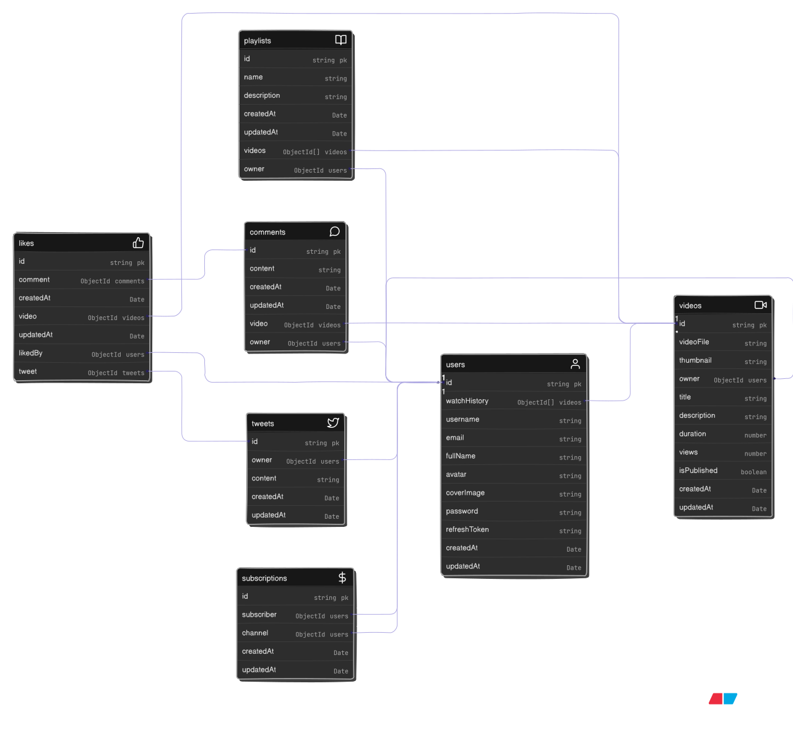

# Learning Backend

This is my repo for learning Backend

## Model for Dataflow



### notes
# part 1
* git normaly does not allow to track the empty folder since 
it is not have any data but to so we can create a '.gitkee file
 so that we track and push the empyt empty folder which is use later in time. 

* - git ignore  which have to ignore for particular project you can take form .gitignore generator websit
- link : https://www.toptal.com/developers/gitignore/api/node 
- link : https://mrkandreev.name/snippets/gitignore-generator/#Node

* Adding "type": "module" in your package.json tells Node.js to treat .js files in your project as ECMAScript Modules (ESM) instead of CommonJS modules, which is the default in Node.js.

| Feature                    | Without `"type": "module"` (CommonJS) | With `"type": "module"` (ESM)                 |
| -------------------------- | ------------------------------------- | --------------------------------------------- |
| Imports                    | `const x = require('x')`              | `import x from 'x'`                           |
| Exports                    | `module.exports = {}`                 | `export default {}` or `export const x = ...` |
| File extension needed      | Can often omit `.js`                  | Must include `.js`, `.mjs`, etc.              |
| `__dirname` / `__filename` | Available by default                  | Not available – must use `import.meta.url`    |
| Top-level `await`          | Not allowed                           | Allowed                                       |

* using the nodemon to rerun the server automatically after save(it is devdependency mean only in product not in development)
- install uses : npm i nodemon (not recommened it intall as main dependency)
               : npm install --save-devo nodemon /  npm i -D nodemon (recommended devedependcy) 
- after write this in pkg.json file to specify which file run .
``` "scripts": {
    "dev": "nodemon src/index.js"
  },
  ```

* create file controller db middleware models routes in src
* install prettiesr as dev dependency
     ''npm i -D prettier''
* configure prettier file 

# part 2
* step mongodb altas for cloud mongodb solution by mongdb 
  - login , create clustor database access , network acces , goto clustor press connect ,choose collection
  - option  , copy url/uri and done 
  - paste in MONGO_URI variable in .enb

* now connect database with backend
  type 1 in main index.js file
  type 2 in db file (clean and more structure code)

'database is always in another continent means there might possibly of connect fails or takes time for request'
  - always use try/catch or promise (connect check)
  - use async/await for response

import dotenv need speacial config in index and in pkg.json
  "scripts": {
    "dev": "nodemon -r dotenv/config --experimental-json-modules src/index.js"
  },
               